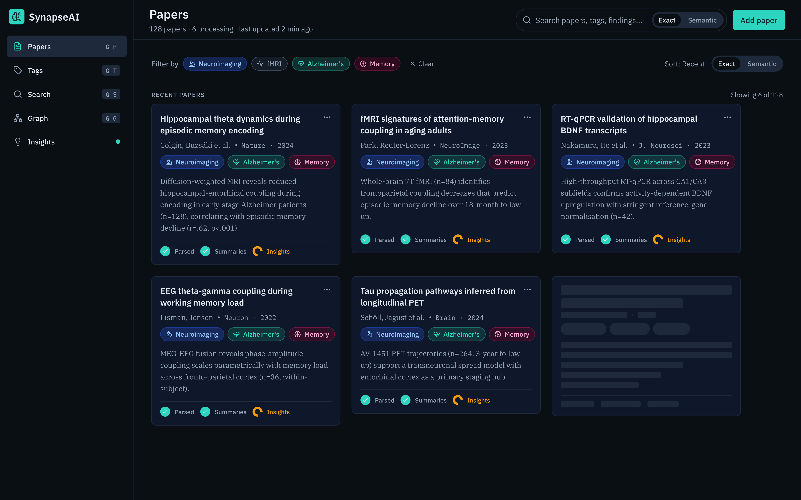

# SynapseAI

An AI-powered research paper platform that ingests, analyzes, and lets you **chat with** scientific literature. Upload a paper — SynapseAI extracts its content, generates expert summaries, tags it intelligently, and cross-references it against your entire corpus.

All AI features run through **Claude CLI** (subprocess), leveraging the fixed-price Pro/Max plan instead of per-token API billing — making heavy LLM usage cost-effective at scale.

- 📄 **Multi-Source Ingestion** — Upload PDFs, paste a URL, or enter a DOI — SynapseAI handles acquisition and text extraction automatically
- 🧠 **AI Summaries** — Claude CLI generates short & detailed summaries, key findings, and metadata extraction for every paper
- 🏷️ **Smart Tagging** — Papers are categorized into a managed taxonomy (sub-domain, technique, pathology, topic) by the AI
- 🔍 **Semantic Search** — pgvector-powered similarity search across your entire corpus, with full-text fallback
- 💬 **RAG Chat** — Ask questions about a single paper or your whole library — answers grounded in your actual research
- 🔗 **Cross-References** — Automatically detects citations, contradictions, and extensions between papers

> 🚧 **In active development.** Backend is functional, frontend and chat features are being built. Previously named NeuroAI — see [v1 history](#-v1--neuroai).

---

## 📸 Preview



---

## 🛠️ Tech Stack

| Layer | Technology |
|-------|------------|
| **Backend** |      |
| **AI** |    |
| **Database** |   |
| **Infrastructure** |    |
| **Frontend** *(planned)* |   |

---

## ⚙️ Processing Pipeline

Every paper goes through a 6-step pipeline, each tracked independently so failures don't block progress:

```
📥 uploading     Download PDF or fetch web content
       ↓
📝 extracting    Extract text (pdfplumber for PDFs, trafilatura for web)
       ↓
🧠 summarizing   Claude generates summaries, key findings & metadata
       ↓
🏷️  tagging       Claude assigns tags from managed taxonomy
       ↓
📐 embedding     Sentence-transformers chunks → pgvector (384-dim HNSW)
       ↓
🔗 crossrefing   Claude detects relations across the corpus
```

Each step has its own status (`pending → processing → done | error | skipped`) and can be retried individually. Real-time progress is streamed via **Server-Sent Events (SSE)**.

---

## 🏗️ Architecture

```
synapseai/
├── api/                  # FastAPI backend
│   ├── app/
│   │   ├── core/         # DB engine, base models, enums, exceptions
│   │   ├── papers/       # Paper CRUD, upload, file serving
│   │   ├── processing/   # Pipeline orchestration, Claude integration, SSE
│   │   ├── tags/         # Tag taxonomy, merge, CRUD
│   │   ├── chat/         # RAG chat sessions (planned)
│   │   ├── insights/     # Research intelligence (planned)
│   │   └── utils/        # Text extraction, URL validation, DOI resolution
│   ├── alembic/          # Database migrations
│   └── tests/            # pytest-asyncio, real PostgreSQL
├── v1/                   # Legacy NeuroAI system (archived)
├── docker-compose.yml
└── .env.example
```

- **Domain-driven design** — each feature owns its models, schemas, router, service, and exceptions
- **Async from day one** — SQLAlchemy 2.0 async + asyncpg, no blocking I/O
- **10 database tables** — papers, steps, tags, embeddings, cross-references, chat, insights
- **SSRF protection** — async DNS resolution + private IP blocking on all URL inputs

---

## 🚀 Getting Started

### Prerequisites

- Docker & Docker Compose
- [Claude CLI](https://claude.ai/claude-code) installed and authenticated

### Setup

```bash
# Clone the repository
git clone https://github.com/thibaultherve/SynapseAI.git
cd SynapseAI

# Configure environment
cp .env.example .env

# Start all services
docker-compose up -d

# Run database migrations
docker-compose exec api alembic upgrade head

# Verify everything works
curl http://localhost:8000/api/health
# → {"status":"ok","database":"connected"}
```

### Running Tests

```bash
docker-compose exec api pytest -v
```

### Services

| Service | Port | Description |
|---------|------|-------------|
| `api` | 8000 | FastAPI backend (auto-reload in dev) |
| `db` | 5432 | PostgreSQL 16 + pgvector |
| `db-test` | 5434 | Isolated test database |

---

## 📡 API Endpoints

### Papers
```
POST   /api/papers/upload          Upload PDF (multipart)
POST   /api/papers                 Create from URL or DOI
GET    /api/papers                 List (paginated, filterable)
GET    /api/papers/:id             Full paper detail
GET    /api/papers/:id/file        Download original PDF
PATCH  /api/papers/:id             Update metadata
DELETE /api/papers/:id             Delete (cascade)
```

### Processing
```
GET    /api/papers/:id/steps       List processing steps
POST   /api/papers/:id/retry/:step Retry a failed step
GET    /api/papers/:id/status      SSE stream (real-time progress)
```

### Tags
```
GET    /api/tags                   All tags grouped by category
GET    /api/tags/:id/papers        Papers with a specific tag
PATCH  /api/tags/:id               Rename tag
DELETE /api/tags/:id               Delete tag
POST   /api/tags/merge             Merge source → target
```

---

## 🔜 Upcoming Features

| Feature | Description |
|---------|-------------|
| 🔍 **Semantic Search** | Full-text + vector similarity search across the corpus |
| 💬 **RAG Chat** | Chat with a single paper or the entire library, answers grounded in your research |
| 🌐 **React Frontend** | SPA with PDF viewer, chat panel, and tag management |
| 📊 **Insight Engine** | AI-generated research gaps, hypotheses, and trend detection |
| 🗺️ **Knowledge Graph** | Visual exploration of paper relationships and cross-references |

---

## 📜 v1 — NeuroAI

SynapseAI is the successor to **NeuroAI**, a Notion-based research assistant built with Claude Code skills and Python scripts. v1 is archived in the [`/v1`](v1/) directory with its own [README](v1/README.md).

| | **v1 — NeuroAI** | **v2 — SynapseAI** |
|---|---|---|
| **UI** | Notion database | React SPA *(planned)* |
| **Data** | JSON flat files + Notion API | PostgreSQL + pgvector |
| **Processing** | Claude Code skills → Python scripts | FastAPI async pipeline |
| **Search** | Tag-based only | Semantic + full-text |
| **Chat** | Comment-based Q&A in Notion | RAG with conversation history |
| **Deployment** | Manual skill triggers | Docker Compose, containerized |

---

## 📝 License

This project is **source-available** under a non-commercial license. You are free to view, fork, modify, and redistribute the code — as long as it remains **non-commercial** with attribution.

See [LICENSE](LICENSE) for details.

---

## 🤖 AI Usage

In the interest of transparency: AI is used regularly throughout this project as a development tool — for code generation, refactoring, debugging, and documentation. But it remains exactly that: a tool. As the sole developer, I define the architecture, enforce best practices, and maintain full control over technical direction. AI accelerates execution — it doesn't replace thinking.

---

## 👤 Author

<table>
  <tr>
    <td align="center">
      <strong>Thibault Hervé</strong><br/>
      Full-Stack Developer<br/>
         <br/><br/>
      <a href="https://www.linkedin.com/in/thibaultherve8/"></a>
      <a href="https://github.com/thibaultherve"></a>
    </td>
  </tr>
</table>
